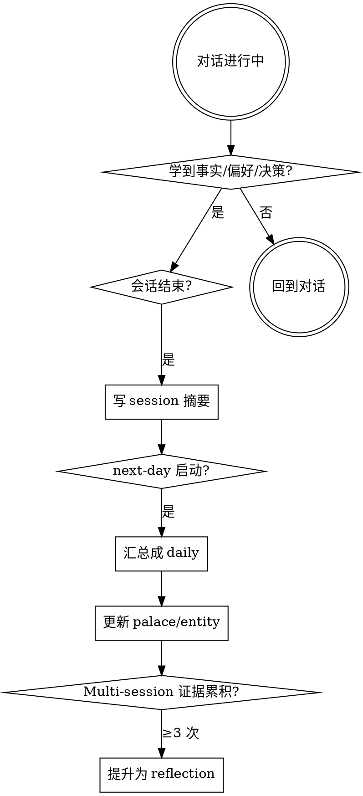

# Chrono-Palace Memory（时间宫殿记忆系统）

## Overview

一个本地长期记忆系统，把"什么时候发生（Chrono）"、"关于谁/什么（Entity）"、"怎么找到（Semantic）"、"怎么长期组织（Palace）"、"agent 学到了什么（Reflection）"五个问题用**五层独立但互链**的结构分别解决。

**核心准则**：
- 时间树 = 证据系统（可溯源、可删除、有 TTL）
- 领域树 = 知识系统（按主题长期组织）
- 宫殿法 = 回忆系统（agent 主动调用的认知地图）
- 语义/关键词索引 = 搜索系统
- 反思层 = agent 自身的学习记录

**违反字面规则就是违反精神。** 所有写入都必须带 `name`、`type`、`confidence`、`importance`、`evidence`、`status`、`created_at`，否则不要写。schema 不可商量。

## 存储位置

所有记忆数据存储在 `~/.memory/`（绝对路径写死，不要用相对路径推断）。

## 启动序列（HARD RULE）

**调用本 skill 后，第一个动作必须是 `Read ~/.memory/MEMORY.md`。** 没有例外：

- 不要先回答用户问题
- 不要先做其他工具调用
- 不要因为"看起来不需要记忆"就跳过 —— 你不读就不知道需不需要

`~/.memory/MEMORY.md` 是这套系统的索引，本身不会被 Claude Code 自动加载（它不在 skill 包里）。**不读它，等于没有这套记忆系统。**

读完 MEMORY.md 后判断：
1. 用户当前问题是否涉及索引里某条 active 记忆 → 深入读对应文件
2. 是否涉及一个尚未记录的实体/项目 → 准备稍后写入
3. 其余情况 → 继续对话，写入时再回到 skill

新增记忆时**同步更新 `~/.memory/MEMORY.md` 的对应索引行**，否则记忆会变成孤儿。

## 语言策略

| 内容 | 语言 |
|------|------|
| Frontmatter 字段名（`name` / `description` / `evidence` / 等）| 永远英文，跨语言统一 |
| `name:` slug 与文件名 | 英文 kebab-case |
| 文件正文、`description:` 值、列表项、引用 | **与用户对话使用的语言一致** |

用户用英文交流就写英文记忆；用中文就写中文；用日文就写日文。一份记忆里不要混语言（除非用户本来就在 code-switch）。**不要因为本文档是中文写的就把所有用户的记忆都翻成中文。**

## 五种记忆类型

| 类型 | 存储位置 | 生命周期 | 写入时机 |
|------|---------|---------|---------|
| **Session 会话** | `~/.memory/sessions/YYYY/MM/DD/session_NNN.md` | 30 天后压缩进 daily 并删除 | 每次对话结束时 |
| **Daily 每日** | `~/.memory/daily/YYYY/MM/DD.md` | 长期保存，被月度记忆压缩 | 每日结束（或下一次会话开始时回填） |
| **Palace 领域宫殿** | `~/.memory/palace/<room>.md` | 长期，由 daily 持续更新 | 主题状态变化时 |
| **Entity 实体** | `~/.memory/entities/<type>/<name>.md` | 长期，按对象组织 | 学到稳定对象信息时 |
| **Reflection 反思** | `~/.memory/palace/learned_patterns.md` | 长期，需多次证据 | 多次会话后才提升 |

> **关键澄清**：写 session **不等于**提升偏好/事实到 palace。Session 是临时层（30 天 TTL），是事实的"原始入口"。要进 palace/entity 必须经过 daily 聚合 + 升级规则（≥2 次证据进 entity，≥3 次进 palace）。

## 五层架构

```
┌──────────────────────────────────────────────┐
│  Reflection Layer  反思层（学到的模式）        │
├──────────────────────────────────────────────┤
│  Palace Layer      宫殿层（长期主题组织）       │
├──────────────────────────────────────────────┤
│  Entity Layer      实体层（稳定对象）           │
├──────────────────────────────────────────────┤
│  Semantic Layer    语义层（关键词/向量索引）    │
├──────────────────────────────────────────────┤
│  Chrono Layer      时间层（证据 + TTL）         │
└──────────────────────────────────────────────┘
```

下层是证据，上层是抽象。**上层每条记忆必须能链回下层证据**（用 `evidence: - daily/2026/05/13.md` 等字段）。

## 反模式（这是新 agent 最容易犯的错）

| 直觉做法 | 实际应做 |
|---------|---------|
| 创建 `~/.memory/preferences.md` 或 `notes.md` 扁平存东西 | **绝对不要自创路径**。按上表写入 `palace/preferences.md` / `sessions/YYYY/MM/DD/session_NNN.md`。 |
| `grep -r "vite" ~/.memory/` 找旧记忆 | 用 `tools/search.py "vite"`，已经做了评分排序。 |
| 用户改主意了，直接 sed/edit 把旧文件改掉 | 旧文件改 `status: superseded` + `superseded_by`，新文件 `supersedes`。**永不覆盖**。 |
| 会话结束顺手 update 任何 palace 文件 | 一次出现 = 临时事实。先写 session，多次累积后才提升到 palace。 |
| frontmatter 我现在没空写，先 append 内容明天补 | **不允许**。没 frontmatter 的文件 validator 会报错；写一半就停手。 |
| 创建文件后忘记更新 MEMORY.md | 索引同步必须和写入在**同一个 tool-call 批次**。 |

## 何时写入



详细规则见 [references/writing-rules.md](references/writing-rules.md)。

## 何时检索

任何时候你认为以下情况之一发生时，**先读 MEMORY.md 然后按需深入**：

1. 用户提到过去某次对话、某个项目、某个决策
2. 用户问"我之前/上次/那个 X 是怎么..."
3. 你即将给出可能与用户偏好相关的建议
4. 用户提到的实体（项目名、人名、工具）出现在 entity 索引中
5. 用户明确要求"回忆/记得/检查"

**用 `python3 tools/search.py "<query>"`，不要直接 grep 整个 `~/.memory/`。** search.py 内置评分公式（语义/recency/importance/entity/confidence），grep 是最差的 fallback。四路检索流程见 [references/retrieval.md](references/retrieval.md)。

## 关键不变量

1. **不直接覆盖旧记忆。** 用 `status: superseded` + `superseded_by` 字段保留历史。冲突处理见 [references/lifecycle.md](references/lifecycle.md)。
2. **不写入未确认的人格推断、敏感信息、一次性情绪。** 详见 [references/writing-rules.md](references/writing-rules.md) 的 "不应写入" 部分。
3. **每条上层记忆必须有 evidence 字段链回下层。** 否则它就是漂浮在真空中的断言。
4. **MEMORY.md 是索引不是仓库。** 每行 ≤150 字符，超过 200 行会被截断。
5. **相对日期一律转为绝对日期。** "周四" → "2026-05-14"，否则三个月后无法解释。
6. **写入前先检查现有记忆是否可更新。** 不要写重复记忆。

## 模板

| 用途 | 模板 |
|------|------|
| 会话记忆 | [templates/session.md](templates/session.md) |
| 每日记忆 | [templates/daily.md](templates/daily.md) |
| 宫殿房间 | [templates/palace-room.md](templates/palace-room.md) |
| 实体记忆 | [templates/entity.md](templates/entity.md) |
| 反思记忆 | [templates/reflection.md](templates/reflection.md) |

## 与默认 auto memory 的关系

本 skill **替代** Claude Code 默认的 auto memory 行为（系统提示中描述的 `~/.claude/projects/.../memory/` 简单存储）。两者不要并用 —— 默认系统只有扁平 `user/feedback/project/reference` 四类，本系统的五层结构是其超集且**不向后兼容**。

记忆数据存储位置也改了：从 `~/.claude/projects/<encoded>/memory/` 改为全局 `~/.memory/`，跨项目共享。如遇旧路径下有遗留文件，把它们按映射手工迁移到 `~/.memory/` 的对应层即可（默认 auto memory 的 `user_*` → `entities/user.md` + `palace/profile.md`；`feedback_*` → `palace/preferences.md`；`project_*` → `entities/projects/`；`reference_*` → `entities/tools/` 或 `entities/concepts/`）。

## 红旗清单（出现这些念头时停下）

| 念头 | 现实 |
|------|------|
| "这条记忆显然" | 显然对你 ≠ 显然对未来的 Claude。写明 evidence 和 confidence。 |
| "直接覆盖旧的就行" | 永远不要。用 superseded 链。 |
| "用户没明说但我推断..." | 不要写。等多次证据。 |
| "这是一次性的，但很有意思" | 不写。一次性 = 临时事实，不进长期记忆。 |
| "MEMORY.md 里写详情更方便" | 不行。MEMORY.md 是索引。内容写到单独文件。 |
| "今天的事先放着，明天再整理" | 必须在会话结束时至少留 session 摘要。 |
| "这次对话看起来不需要记忆，跳过 MEMORY.md" | 启动序列没有例外。你不读就不知道需不需要。 |
| "写入完直接结束，索引下次再说" | 索引同步必须和写入在**同一个 tool-call 批次**。 |

## 配套工具

写入 / 检索 / 清理 / 校验 都由 `tools/*.py` 脚本辅助，用法详见 [references/tools.md](references/tools.md)。常用调用：

- `python3 tools/validate.py` — 校验所有记忆文件 frontmatter 与链接
- `python3 tools/search.py "<query>"` — 检索（有 neural cache 时用 embedding，否则 TF-IDF）
- `python3 tools/aggregate-daily.py [YYYY-MM-DD]` — 把当日 session 聚合成 daily 草稿
- `python3 tools/aggregate-monthly.py [YYYY-MM]` — 把当月 daily 聚合成 monthly 草稿
- `python3 tools/aggregate-yearly.py [YYYY]` — 把当年 monthly 聚合成 yearly 草稿
- `python3 tools/expire-sessions.py` — 清理已 promote 且 expires_at 已过的 session
- `python3 tools/find-conflicts.py --topic <topic>` — 找潜在冲突
- `python3 tools/forget.py --topic <term>` — 用户要求遗忘时软删除（dry-run，--apply 才生效）
- `python3 tools/daily-status.py` — 快速状态检查（适合 SessionStart hook / cron）
- `python3 tools/migrate.py [--list|--apply]` — 应用 schema 迁移
- `python3 tools/embed.py` — 构建 neural embedding 缓存（需安装 sentence-transformers）
- `python3 tools/sync.py` — 多机同步（`~/.memory` 作为 private git repo）

## Bottom Line

**Chrono 保存"何时"，Entity 保存"关于谁/什么"，Semantic 解决"怎么找到"，Palace 解决"怎么长期组织"，Reflection 解决"agent 学到了什么"。** 这五层不要混在一起，但必须互相链接。
