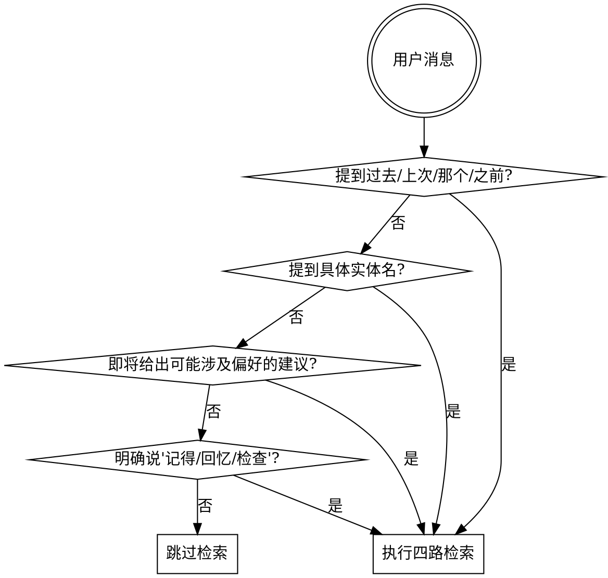

# 检索

## 四路并行检索

任何检索任务都同时启动四路，最后合并去重排序。

```
        用户问题
            │
            ▼
      Query Analyzer
   （识别意图、时间词、实体）
            │
   ┌────────┼────────┬─────────┐
   ▼        ▼        ▼         ▼
 时间检索  语义检索  实体检索  宫殿检索
   │        │        │         │
   └────────┴────────┴─────────┘
            │
            ▼
       候选记忆集合
            │
            ▼
   排序 + 去重 + 冲突检测
            │
            ▼
       压缩上下文包
            │
            ▼
        交给主对话
```

### 1. 时间检索（Chrono）

触发条件：用户提到具体或相对时间。

- "昨天/上次/前两天/三月份" → 算出日期范围 → 读 `sessions/YYYY/MM/DD/` 和 `daily/YYYY/MM/DD.md`
- 没有时间词时跳过此路

### 2. 语义检索（Semantic）

触发条件：始终运行。

- 提取问题中的 3-5 个关键词
- 查 `index/keyword_index.md` 找匹配文件
- 没有向量索引时，关键词匹配即可

### 3. 实体检索（Entity）

触发条件：问题中提到项目名、人名、工具名、概念。

- 查 `index/entity_index.md`
- 命中实体后读对应 `entities/.../<name>.md`
- 同时读 entity 文件中 `references:` 字段链向的 palace 房间

### 4. 宫殿检索（Palace）

触发条件：问题涉及偏好、习惯、决策、未完成事项、用户身份。

- 读对应 `palace/*.md` 房间
- 不是全部读，按问题类型路由：
  - 偏好类问题 → `preferences.md`
  - 决策回顾 → `decisions.md`
  - 未完成事项 → `open_loops.md`
  - 模式问题 → `learned_patterns.md`

## 评分公式

```
score = 0.40 * semantic   (TF-IDF cosine, stdlib only)
      + 0.20 * recency
      + 0.20 * importance
      + 0.10 * entity_match
      + 0.10 * confidence
```

**Semantic 实现细节**（在 `tools/search.py`）：
- Tokenizer：拉丁字按词（≥2 字符），CJK 按字 unigram —— 无需 jieba / sentence-transformers 等外部依赖
- 文档池：每个 memory 文件取 `description + name + topics + body[:4000]` 拼接后 tokenize
- IDF：`log((N+1)/(1+df)) + 1`，平滑且不为 0
- 向量：sparse TF-IDF dict
- 相似度：cosine

未来升级到真 neural embedding 时只需替换 `_corpus_vectors_and_idf()` 与 `_score_query_semantic()` 两个函数，其余评分公式接口不变。

**但 recency 权重不能盲目应用。** 区分场景：

| 场景 | 看什么 |
|------|--------|
| 稳定事实 | `confidence` + `evidence` 数量 |
| 当前偏好 | `recency`（最近一次确认时间） |
| 项目状态 | `updated_at` 最新 |
| 长期习惯 | `evidence` 重复次数（repetition count） |
| 已废弃信息 | 直接过滤 `status: superseded` |

## 上下文打包

**不要把所有候选记忆原样塞进对话。** 输出一个压缩包：

```yaml
relevant_memory_context:
  stable_facts:
    - 用户当前活跃项目是 memory-skill。
    - 偏好结构化、分层的系统设计。

  current_project_state:
    - 设计方向：Chrono-Palace 五层架构。
    - 已确认决策：双树 + 宫殿 + 反思层。

  recent_discussions:
    - 2026-05-13 完成了完整架构设计与目录初始化。

  open_questions:
    - 长期记忆如何避免污染（在 lifecycle.md 中已有部分答案）。
    - 反思层证据阈值定多少（当前默认 3 次）。

  sources:
    - daily/2026/05/13.md
    - palace/projects/memory-skill.md
    - entities/projects/memory-skill.md
```

字段说明：
- `stable_facts`：高 confidence + 高 importance 的核心事实
- `current_project_state`：当前 in-flight 项目的最新状态
- `recent_discussions`：最近 7 天相关 daily 摘要
- `open_questions`：未解决问题，来自 `open_loops.md`
- `sources`：所有来源文件路径，便于 follow-up

## 召回前先看 MEMORY.md

`MEMORY.md` 是索引，未来 Claude 启动时**始终被加载**。它的作用是回答"是否需要打开某个文件"。

```markdown
# MEMORY.md（示例）

## Profile
- [User](palace/profile.md) — 数据科学背景，正在做长期记忆系统

## Projects (active)
- [memory-skill](palace/projects/memory-skill.md) — Chrono-Palace 长期记忆架构
- [writing-system](palace/projects/writing-system.md) — 文本生成与版本管理

## Preferences (stable)
- [Structured discussion](palace/preferences.md#structured) — 偏好分层架构讨论
- [Chinese responses](palace/preferences.md#language) — 中文回复

## Open loops
- [Reflection threshold](palace/open_loops.md#reflection-threshold) — 反思层证据阈值

## Recent daily entries
- [2026-05-13](daily/2026/05/13.md) — Chrono-Palace 架构初始化
```

每条 ≤150 字符。超过 200 行会被截断，所以**只放索引不放内容**。

## 检索时机判断



## 不要 over-fetch

每次检索的目标是**最少够用的上下文**。

| 错误 | 修正 |
|------|------|
| 读所有 daily 文件 | 只读最近 7 天 + 命中关键词的 |
| 读所有 palace 房间 | 按问题类型路由到 1-2 个房间 |
| 把全部记忆塞进上下文 | 压缩成 `relevant_memory_context` YAML |
| 没用就反复重读 | 一次会话内同一记忆最多读一次 |
