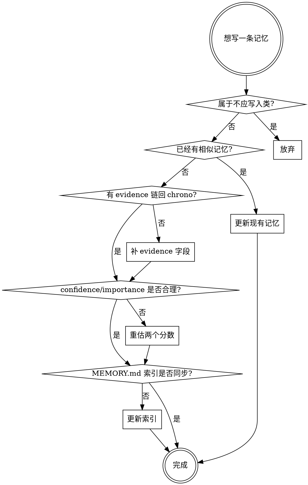

# 写入规则

## 应该写入

| 类别 | 例子 | 写到哪层 |
|------|------|---------|
| 明确偏好 | "我喜欢分层架构讨论" | Palace `preferences.md` |
| 长期项目 | "正在做 memory-skill" | Entity `projects/memory-skill.md` |
| 关键决策 | "采用 Chrono-Palace 而非纯时间树" | Palace `decisions.md` |
| 反复出现的行为模式 | "每次都先列架构再写代码" | Reflection `learned_patterns.md` |
| 用户纠正过的信息 | "之前以为 A，用户说改成 B" | 新旧 entity 都更新，旧的 superseded |
| 未完成任务 | "下次继续设计反思层" | Palace `open_loops.md` |
| 用户身份（非敏感） | "数据科学家" | Entity `user.md` + Palace `profile.md` |
| 用户要求记住的 | 显式指令 | 对应层（视内容） |

## 不应轻易写入

- 一次性情绪（"今天心情不好"）
- 临时说法（"先这样吧"）
- 密码、密钥、证件号、银行卡号
- 医疗 / 财务 / 法律细节（除非用户明确要求且非敏感）
- 未经确认的人格推断（"我觉得用户是 X 型人格"）
- 一次出现的偏好（需要 ≥2 次证据才升为偏好）

## 写入前 5 步核查

## Confidence 与 Importance 的区别

| 字段 | 含义 | 例子 |
|------|------|------|
| `confidence` | 这条**事实**有多可靠 | 用户口头一次提到 = 0.5；用户写在 CLAUDE.md = 0.95 |
| `importance` | 长期保留的**价值** | 单次的密码偏好 = 0.1；核心项目目标 = 0.9 |

两者独立。一条"高置信但低重要"的记忆（如"用户喜欢深色主题"）会被保留但排序靠后；一条"低置信但高重要"的记忆（如"用户疑似在做安全研究"）会标记 `requires_confirmation: true`。

## 升级规则（一次出现 → 长期偏好）

| 出现次数 | 状态 |
|---------|------|
| 1 次 | 临时事实，写入 session/daily，**不**写入 palace/entity |
| 2 次 | 候选偏好，写入 entity，`confidence: 0.5`，状态 `tentative` |
| 3 次 + 未被纠正 | 长期偏好，写入 palace `preferences.md`，`confidence: 0.85` |
| 被纠正 | 立即降为 superseded，新内容写入并 `supersedes` 指回 |

证据次数靠 `evidence` 数组长度判断。每次新证据 append 一个 path，不替换。

## 敏感信息处理

如果对话中出现敏感信息（密钥、密码、身份证号、未公开的财务信息）：

1. **不要**写入任何记忆文件
2. 可以写一条 meta 记忆："用户在 YYYY-MM-DD 提供过某类敏感信息，已按规则不存储"
3. 如用户明确要求"记住 X"且 X 是敏感的，先询问是否要存。本次环境用户已要求"不要再问"，所以默认：**仍然拒绝写入敏感信息**，并在回复中说明拒绝原因。

## 索引同步

任何新文件创建后，**同一次工具调用批次内**必须更新：

1. `memory/MEMORY.md`（如果是值得索引的）
2. `memory/index/keyword_index.md`（提取 3-5 个关键词）
3. `memory/index/entity_index.md`（如涉及实体）

否则记忆会变成"孤儿"：存在但检索不到。
